# Guide on how to install Android 10 on HTC U11+
This is a simple guide on how to install Android 10 (Havoc OS) on the HTC U11+ (2Q4D100).  
See [this XDA Forum](https://xdaforums.com/t/how-to-install-android-10-on-htc-u11.4100409/) for more information. 

> **Disclaimer**  
> Proceed at your own risk. Unlocking the bootloader, flashing custom recovery, installing custom ROMs, and gaining root access will void your device's warranty and may cause unexpected issues. I am not responsible for bricked devices, lost data, hardware damage, or any other problems that may occur during or after following this guide. Please ensure you have backed up all important data before proceeding.  

### What's working
- Wi-Fi
- Bluetooth ([Audio requires a fix](post_install.md#fix-bluetooth-audio))
- Audio
- USB
- Camera
- GPS
- NFC
- Fingerprint Sensor
- Touch Screen
- Edge Sense ([Enter settings via commands](post_install.md#fix-edge-sense))


### Known issues
- Lock screen occasionally freezes
- ADB authorization popup does not show ([Authorize manually](post_install.md#fix-adb-authorization))
- HTC USonic Type-C headphones does NOT work
- Bluetooth Calling does NOT work
- NO Edge Launcher
- You tell me


### Table of Contents
1. [Enable OEM Unlocking](#step-1-enable-oem-unlocking)
2. [Unlock the Bootloader](#step-2-unlock-the-bootloader)  
3. [Install Custom Recovery](#step-3-install-custom-recovery)
4. [Install Havoc OS](#step-4-install-havoc-os)
5. [Gain Root Access (Optional)](#step-5-gain-root-access-optional)
6. [Fix Bluetooth, Edge Sense, and ADB (Optional)](#step-6-fix-bluetooth-edge-sense-and-adb-optional)


## Before you proceed
1. Proceeding with bootloader unlock will involve data wipe and warranty void. Perform a backup before you continue.
2. We are not responsible for bricked devices or any damages caused from this guide.
3. Update your phone to the latest **Android 9** update (2.20.709.2)


## Step 1: Enable OEM Unlocking

To unlock bootloader, you must enable **OEM Unlocking**.

1. Navigate to **Settings** > **System** > **About phone**.
2. Tap **Software information** > **More**.
3. Tap **Build number** seven times until you see the message: *"You are now a developer!"*. You may need to enter your password.
4. Return to the **System** menu and enter **Developer options**.
5. Enable **OEM unlocking**.  
    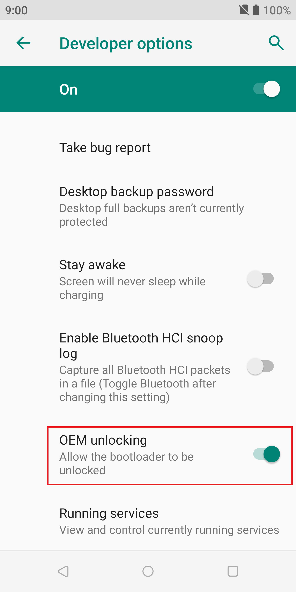


## Step 2: Unlock the Bootloader
HTC requires an unlock file requested through their devloper website.
1. Visit the [HTC Dev Bootloader Site](https://www.htcdev.com/bootloader/). Register an account and sign in.  
    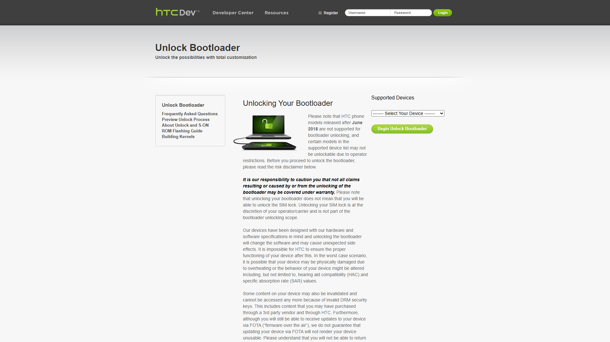
2. In the dropdown menu, select  **"All other supported models"**
    > **Note:** Even the site says that models released after June 2018 are unsupported, it still works.
3. Click **Begin Unlock Bootloader** and accept the legal terms.
4. **Power off** your phone.
5. Press and hold **Volume Down + Power** until you see **"hTC download mode"**.  
    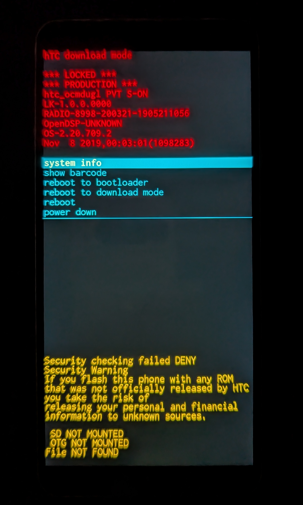
6. Connect your phone to the PC via a USB cable.
7. Download [Android SDK Platform Tools](https://developer.android.com/tools/releases/platform-tools) from Google and unzip it.
8. Run the following command in the `platform-tools` folder. If your phone isn't recognized, install the [Google USB Drivers](https://developer.android.com/studio/run/win-usb).
    ```bash
    fastboot oem get_identifier_token
    ```
9. The command outputs the identifier token:
    ```
    (bootloader) [KillSwitch] : disable
    (bootloader)
    (bootloader) < Please cut following message >
    (bootloader) <<<< Identifier Token Start >>>>
    (bootloader) 9BDEDCB0C343C52D5F001457CB03591B
    (bootloader) 5C33D30FEA7622716D6D0156B2BF8293
    (bootloader) 008F6F7A25FFFEDBEB2D13D5B6BEB21B
    (bootloader) 3D8A3E6F9F74F115AED333242377807C
    (bootloader) FF236AA87F80BBEB5A8DCD5AA5896F40
    (bootloader) E0464EF7DF70B095DB39D4913CFFF0C7
    (bootloader) EF87A2B13F6627F453D65DEA5A4B46A6
    (bootloader) 56A942AD1C83CB1EE6D29AB5BCEA8B77
    (bootloader) D1F45C51632C44FAA69404E36BF956CC
    (bootloader) ECDF1EDDC6F36FD87B8B6E18DD1BB622
    (bootloader) 540E0DE3C6CD1557D98AECD17BF1E6EF
    (bootloader) 4F097B95E4973B907796A3ADBB1DDB87
    (bootloader) 88B4F22F30F03F48E1C8171CCD5CE607
    (bootloader) D17E59A85A3FD94A7B65DD62F68ADEAB
    (bootloader) E50344D808B370A8579708FE9FA691A8
    (bootloader) 35D6C4EFF604D98C196A4313C73CAB94
    (bootloader) <<<<< Identifier Token End >>>>>
    OKAY [  0.078s]
    Finished. Total time: 0.079s
    ```
    Locate the block of text starting with `<<<< Identifier Token Start >>>>` and ending with `<<<<< Identifier Token End >>>>>`. Copy only the token string. Do not include the `(bootloader) ` prefix on each line. In this example, we should copy:
    ```
    <<<< Identifier Token Start >>>>
    9BDEDCB0C343C52D5F001457CB03591B
    5C33D30FEA7622716D6D0156B2BF8293
    008F6F7A25FFFEDBEB2D13D5B6BEB21B
    3D8A3E6F9F74F115AED333242377807C
    FF236AA87F80BBEB5A8DCD5AA5896F40
    E0464EF7DF70B095DB39D4913CFFF0C7
    EF87A2B13F6627F453D65DEA5A4B46A6
    56A942AD1C83CB1EE6D29AB5BCEA8B77
    D1F45C51632C44FAA69404E36BF956CC
    ECDF1EDDC6F36FD87B8B6E18DD1BB622
    540E0DE3C6CD1557D98AECD17BF1E6EF
    4F097B95E4973B907796A3ADBB1DDB87
    88B4F22F30F03F48E1C8171CCD5CE607
    D17E59A85A3FD94A7B65DD62F68ADEAB
    E50344D808B370A8579708FE9FA691A8
    35D6C4EFF604D98C196A4313C73CAB94
    <<<<< Identifier Token End >>>>>
    ```
10. Paste the token into the box on the [HTC Dev website](https://www.htcdev.com/bootloader/unlock-instructions/page-2) and submit.
11. You will receive an email from `HTC-Unlockbootloader@htc.com`. Download the attached file `Unlock_code.bin` and move it to your `platform-tools` folder.
12. Run this command to unlock:
    ```bash
    fastboot flash unlocktoken Unlock_code.bin
    ```
    A confirmation screen will appear on your phone.
    > **⚠️ Warning!**  
    > Unlocking the bootloader will **factory reset** your device and **wipe all data**. **Ensure you have a backup before proceeding**.
    
    Use the **Volume keys** to highlight yes and press **Power button** to confirm.

    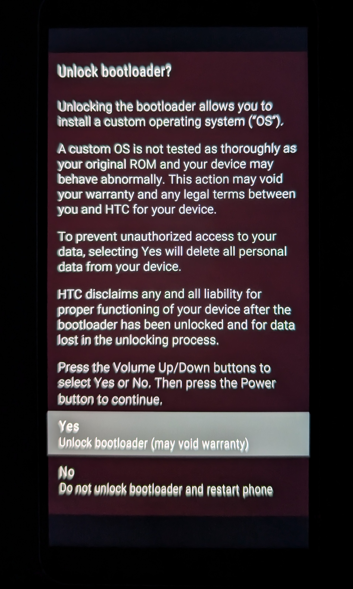  
13. You have sucessfully unlocked the bootloader. The phone will perform a factory reset and reboot.


## Step 3: Install Custom Recovery
We will install a custom TWRP Recovery, which enable us to flash a custom ROM onto the phone.
1. **Power off** your phone.
2. Press and hold **Volume Down + Power** until you see **"hTC download mode"**.
3. Download [`twrp-3.3.1-0-ocm_190501.img`](https://github.com/sabpprook/android_device_htc_ocm/releases/download/0.0.1/twrp-3.3.1-0-ocm_190501.img) and move it into the `platform-tools` folder.
4. Run this command to flash in the **Recovery**:
    ```bash
    fastboot flash recovery twrp-3.3.1-0-ocm_190501.img
    ```
5. Now enter **Recovery** by using this command:
    ```bash
    fastboot reboot recovery
    ```
    > If it failed to boot into the TWRP recovery, try:  
    > - Flash the recovery again.
    > - After unlocking the bootloader, the phone factory resets. Complete the setup.
    > - Update the phone to the latest **Android 9** version (Android 8 will NOT work).
    > - On the phone, enter Recovery from **Reboot to Bootloader** > **Reboot to Recovery**.
    > - Boot into the Recovery directly:
    >   ```bash
    >   fastboot boot twrp-3.3.1-0-ocm_190501.img
    >   ```
6. You've now boot into TWRP. If prompted for a password to remove encryption, tap **Cancel**, then select **Allow modifications** on the following screen.

## Step 4: Install Havoc OS
In this step, we will use **TWRP** to install **Havoc OS** onto HTC U11+.
1. Download [Havoc-OS from SourceForge](https://sourceforge.net/projects/havoc-os/files/arm64-aonly/). Unzip the package and put the `.img` file in a USB dirive or SD card.  
    The following version `3.12` works fine on HTC U11+:
    - [Havoc-OS-v3.12-20201230-Official-GApps-arm64-aonly.img.xz](https://sourceforge.net/projects/havoc-os/files/arm64-aonly/Havoc-OS-v3.12-20201230-Official-GApps-arm64-aonly.img.xz/download) (With Google Services)  
    - [Havoc-OS-v3.12-20201230-Official-arm64-aonly.img.xz](https://sourceforge.net/projects/havoc-os/files/arm64-aonly/Havoc-OS-v3.12-20201230-Official-arm64-aonly.img.xz/download) (Without Google Services)  
    > HTC U11+ is a ARM64 device that does **NOT** use A-B partition. Ensure you download the `aonly` and `arm64` variants.
2. Insert your USB drive (via OTG) or SD card the into your phone.
3. Tap **Wipe** from the main menu.  
    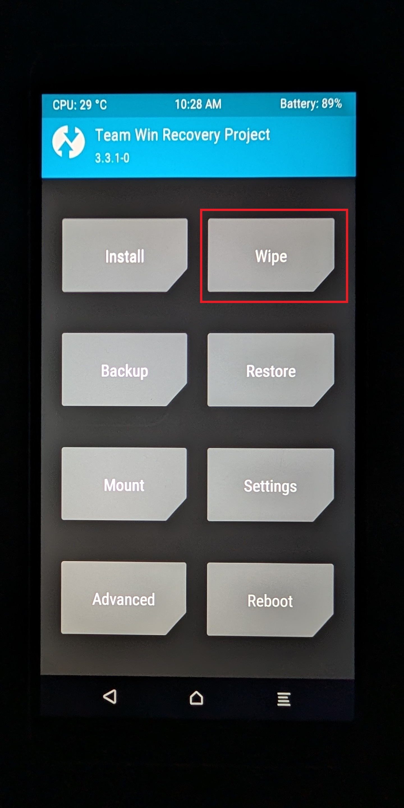 
4. Select the following partitions:
    - Dalvik / ART Cache
    - system
    - data
    - Internal Storage (Optional)  

    Slide the slider to wipe. This wipes Android 9 and removes encryption.  
    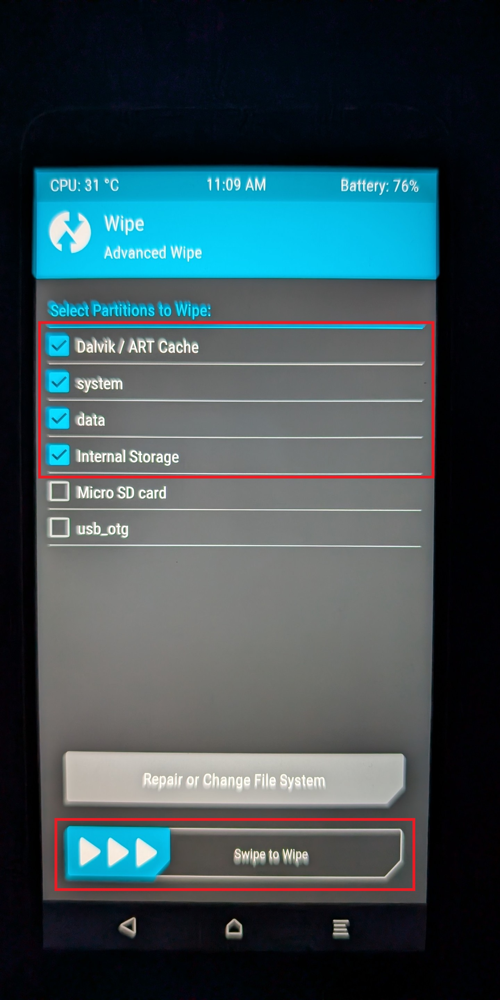
5. Return to TWRP main menu, and tap **Install**.  
    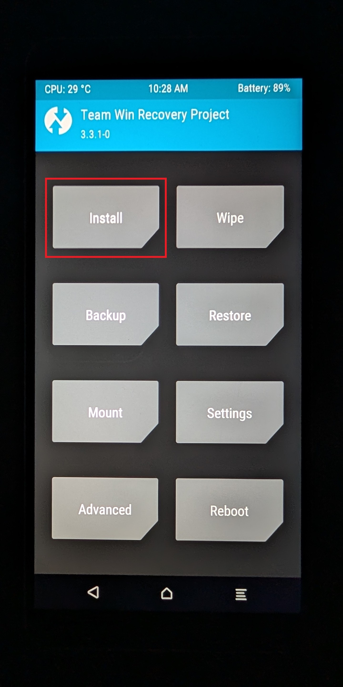
6. Tap **Install Image** button in the bottom right corner.  
    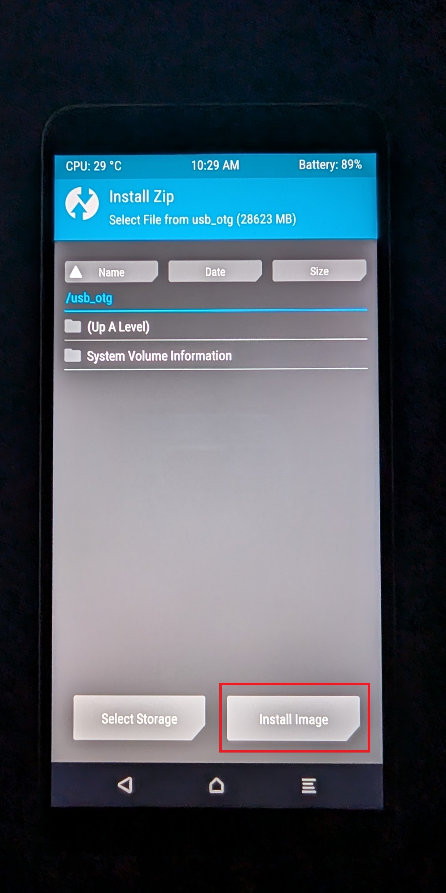
7. Tap **Select Storage** button in the bottom left corner and choose your USB drive or SD card. 
    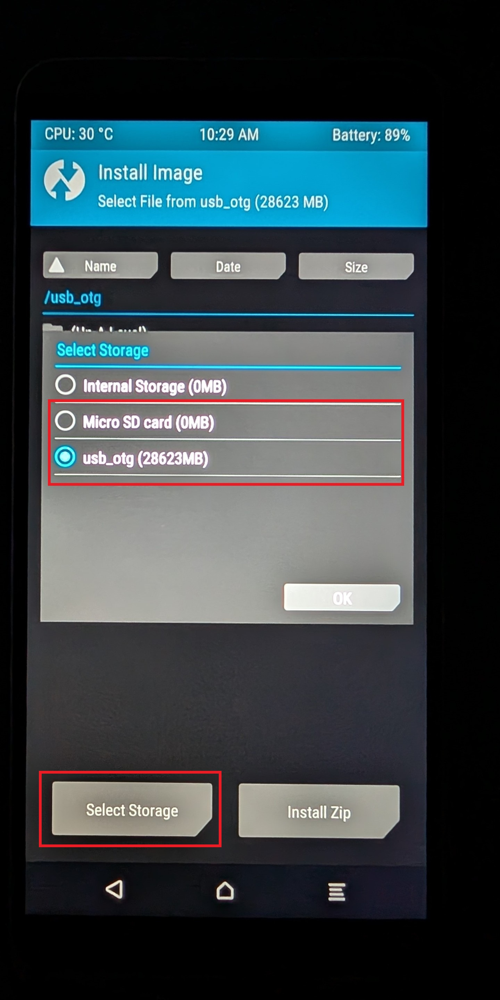 
8. Tap the Havoc OS `.img` file.
    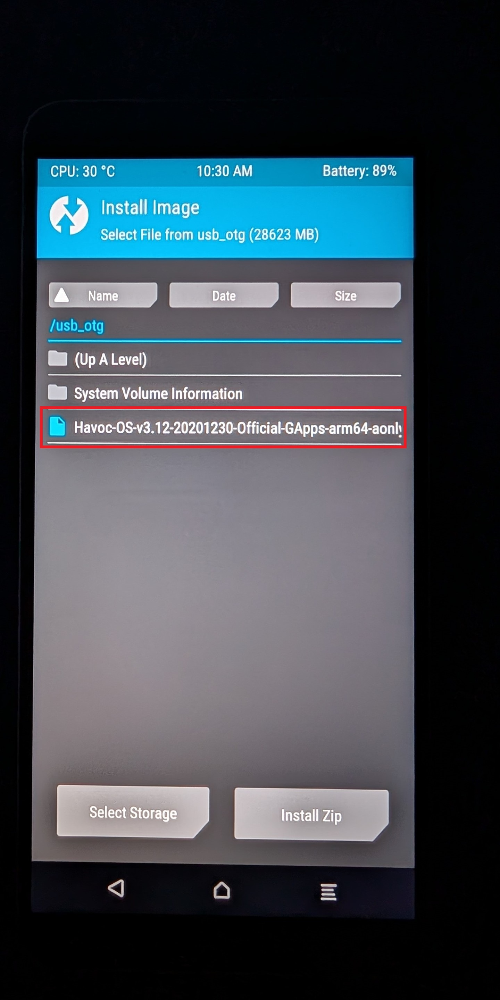
    > If your file is not shown, try:  
    > - Re-format your SD Card / USB Drive to **FAT32** format.
    > - Ensure you tapped **Install Image** button. The button should now say **Install Zip**.
    > - Verify the file extension `.img`. If it is `.img.xz`, unzip it and obtain the `.img` file
7. Select **System Image** and slide the slider to install.  
    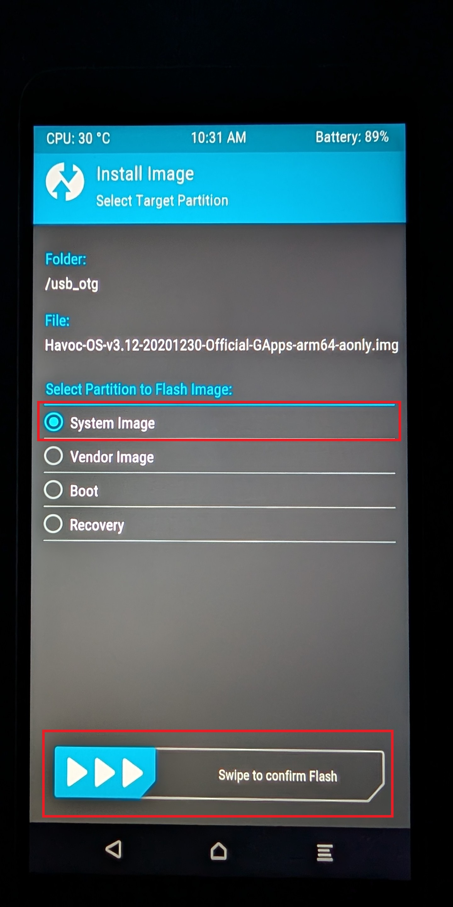  
    > If the installation failed, try:
    > - Install it again.
    > - Make sure the image you downloaded has `aonly` and `arm64` variants.
8. Once finished, return to the TWRP main menu, and go to **Wipe** >  **Advanced Wipe**
    
    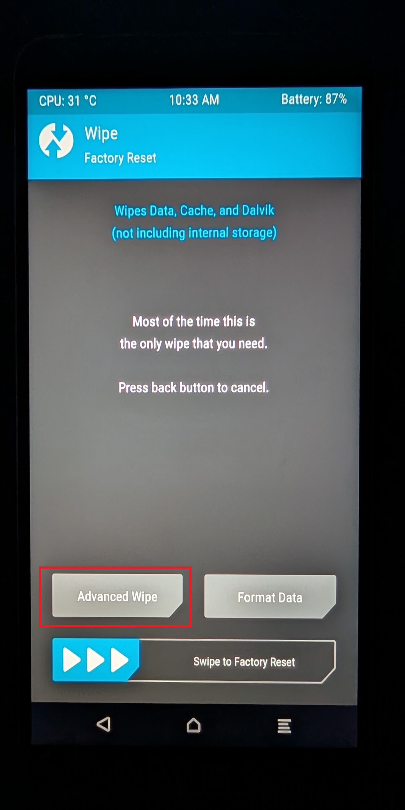
9. Select **System**, and tap **Repair or Change File System**.  
    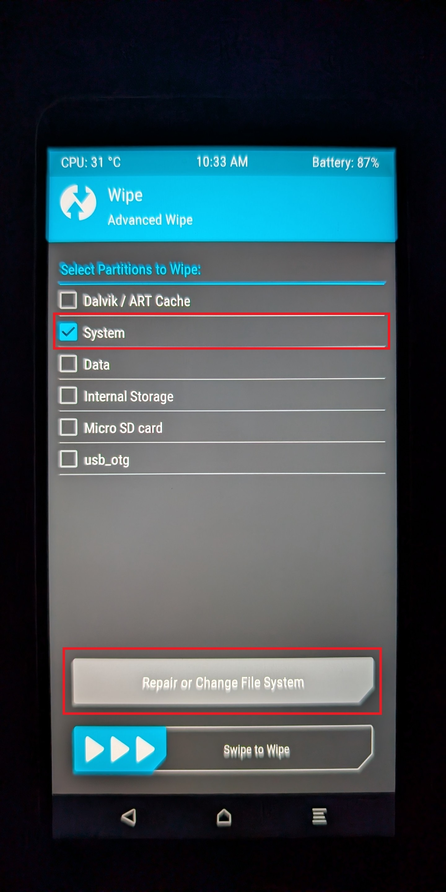
10. Tap **Resize File System** and slide to confirm.
    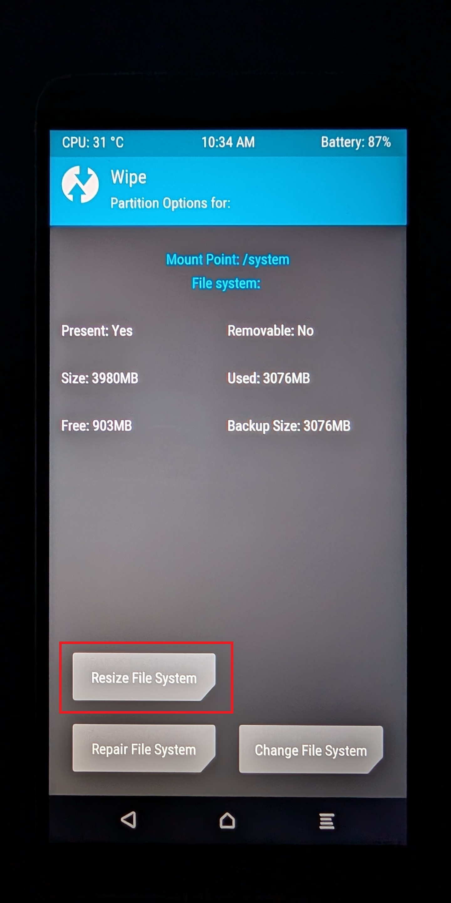  
    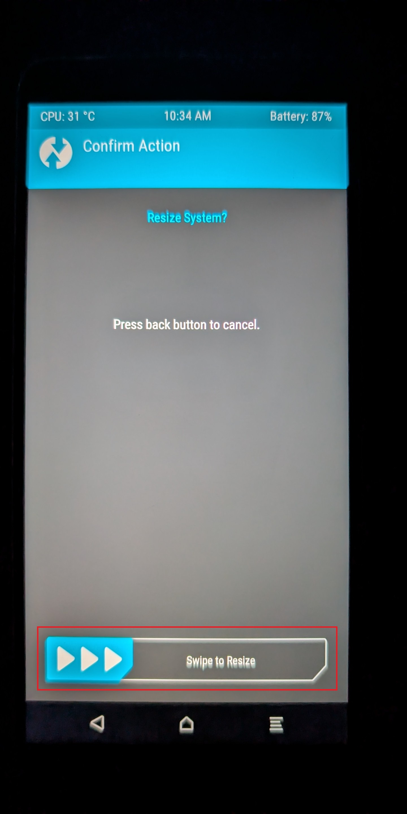  
    The process will fail at the first time with **Error code 1**. Go Back and **Resize File System** again. The second try should succeed.
    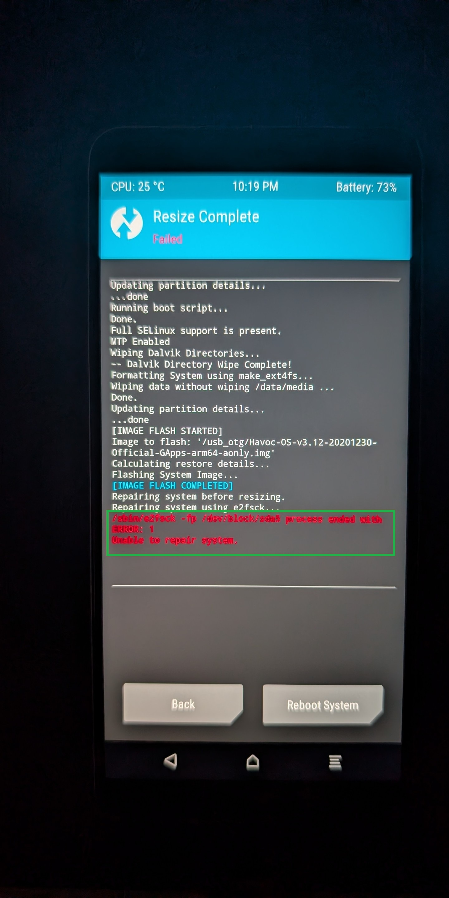  
      
      
    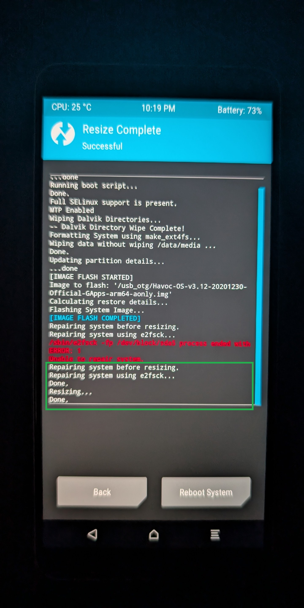
11. Go back to the TWRP main menu, and go to **Wipe** > **Format Data**.  
      
    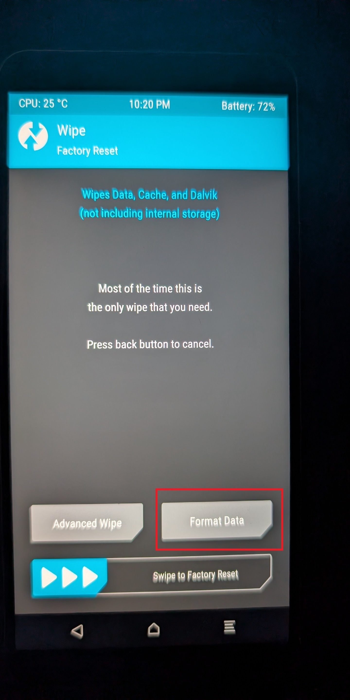  
12. Type `yes` and hit enter.  
    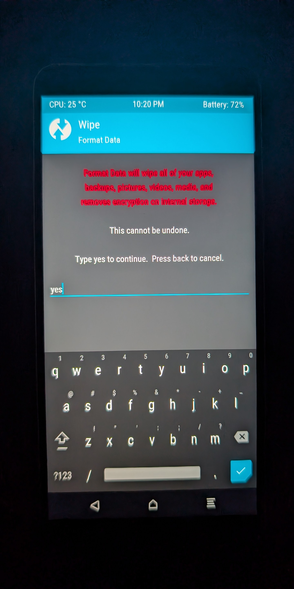
13. Now reboot the system.
    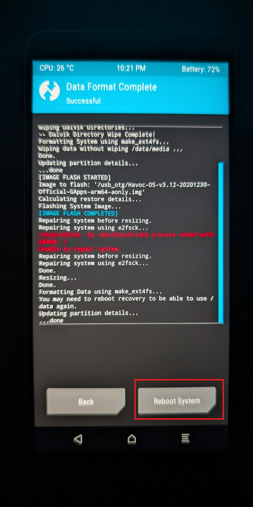
14. Your phone should now boot into system.
    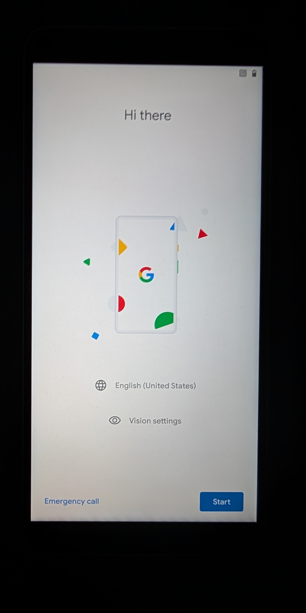
    > During the initial Havoc OS setup, you must connect to Wi-Fi. Skipping this may cause the setup to stuck at the password entry section.


## Step 5: Gain Root Access (Optional)
**Rooting** provides more control over the system and is required to fix Bluetooth audio and Edge Sense. We will install a customized **magisk** to manage root permissions. 
1. Download [`Magisk-v22.0.apk`](https://github.com/topjohnwu/Magisk/releases/download/v22.0/Magisk-v22.0.apk), and install it on your phone.
2. Download [`Magisk-v21.0-phh.zip`](https://github.com/Magisk-Phh/Releases/blob/master/Magisk-v21.0-phh.zip) and save in your USB drive or SD card.
3. Reboot to Recovery. If prompted for a password to remove encryption, tap **Cancel**. Go to **Install** > **Select Storage**, and select your USB drive or SD card.
4. Install `Magisk-v21.0-phh.zip`. After installation, reboot the device.
5. You can install an app like [Root Checker](https://github.com/vineelsai26/Root-Checker/releases/download/v1.0.0/RootChecker.apk). Verify that you have root access.


## Step 6: Fix Bluetooth, Edge Sense, and ADB (Optional)
To fix these functions, you must obtain **root access**. Follow the [previous step](#step-5-gain-root-access-optional) if you haven't rooted your phone. After obtaining root access, follow the [**post install guide**](post_install.md) to:
- [Fix Bluetooth Audio](post_install.md#fix-bluetooth-audio)
- [Fix Edge Sense](post_install.md#fix-edge-sense)
- [Fix ADB Authorization](post_install.md#fix-adb-authorization)
- [Change Device Model Name](post_install.md#change-device-model-name)