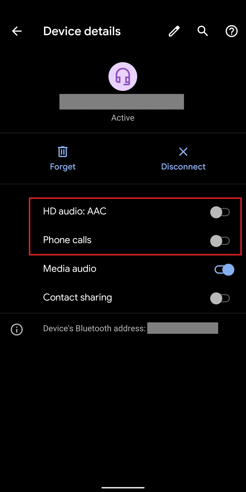

# Post Install
This is a simple guide on how to fix **Bluetooth Audio**, **Edge Sense**, **ADB Authorization**, and **change device model name** after you installed Havoc OS on HTC U11+.


### Table of Contents
1. [Fix Bluetooth Audio](#fix-bluetooth-audio)
2. [Fix Edge Sense](#fix-edge-sense)
3. [Fix ADB Authorization](#fix-adb-authorization)
4. [Change Device Model Name](#change-device-model-name)


## Before you proceed
1. Your HTC U11+ should run **Havoc OS (Android 10)** with **Root Access**. Follow [**Guide on how to install Android 10 on HTC U11+**](README.md) to install **Havoc OS (Android 10)** and [**gain Root Access**](README.md#step-5-gain-root-access-optional).  
2. You will need a **Root File Explorer**. Grant your explorer root permissions.


## Fix Bluetooth Audio
Bluetooth File Transfer works out of the box. However, the audio does not work properly. Follow the following steps to fix Bluetooth audio.

1. Download [`htc_audio_bt_fix.rar`](https://xdaforums.com/attachments/htc_audio_bt_fix-rar.5020101/) and unzip it. You will see three `.xml` files:
    - `a2dp_audio_policy_configuration.xml`
    - `audio_policy_configuration.xml`
    - `primary_audio_policy_configuration.xml`  
    
    Transfer these files to your phone's internal storage.
2. Open a **Root File Explorer** and navigate to **`/vendor/etc`**. Locate `audio_policy_configuration.xml` and `primary_audio_policy_configuration.xml` and copy them to a safe backup folder.
3. Copy the three `.xml` you downloaded in Step 1 and paste then into `/vendor/etc`, overwriting the original files.
4. Set the permission for these three `.xml` files to `644` or `rw-r--r--`. That is, 
    | | Read | Write | Execute |
    | --- | --- | --- | --- |
    | Owner | ✅ | ✅ | |
    | Group | ✅ | | |
    | Others | ✅ | | |
    ```bash
    chmod 644 /vendor/etc/a2dp_audio_policy_configuration.xml  
    chmod 644 /vendor/etc/audio_policy_configuration.xml  
    chmod 644 /vendor/etc/primary_audio_policy_configuration.xml  
    ```
5. Reboot your phone. On the paired device, turn **OFF** Phone Calls. Your Bluetooth device should now play audio correctly.
    > Unfortunately, phone calls do not work. 
    
    


## Fix Edge Sense
To fix Edge Sense, we need to install **Edge Sensor Service** and access the settings menu via **Termux**. 

1. Install [com.htc.sense.edgesensorservice.apk](https://xdaforums.com/attachments/com-htc-sense-edgesensorservice_1-21-1074151-154041341-signed-apk.5231971/) and [Termux](https://github.com/termux/termux-app) on your phone.
2. In **Termux**, enter `su` to get superuser access.
    ```bash
    su
    ```
3. Run this command in **Termux** to start Edge Sense settings activity.
    ```bash
    am start com.htc.sense.edgesensorservice/.ui.SettingsMainActivity
    ```


## Fix ADB Authorization
When you try to run `adb devices`, it shows your device as unauthorized and no confirmation window appears on your phone. Follow the steps to manually authorize your PC. 

1. Locate your PC's ADB key.
    - Windows: `%USERPROFILE%\.android\adbkey.pub`
    - macOS / Linux: `~/.android/adbkey.pub`
    
    Copy the entire string of text inside. Example: `QAAAAFvm6... user@PC`
2. Open a **Root File Explorer** and navigate to **`/data/misc/adb`**. Create a file called `adb_keys` if not existed.
3. Open the `adb_keys` file and paste your PC's ADB key onto a new line at the end of the file.
4. Set the permission for the `adb_keys` file to `640` or `rw-r-----`. That is, 
    | | Read | Write | Execute |
    | --- | --- | --- | --- |
    | Owner | ✅ | ✅ | |
    | Group | ✅ | | |
    | Others | | | |
    ```bash
    chmod 640 ~/.android/adbkey.pub  
    ```
5. Reboot your phone, and the ADB should work correctly now.


## Change Device Model Name
The phone model name shown in **Settings > About phone > Model & hardware** is "phh-treble". To change it to "HTC U11 plus", follow these steps:

1. Open a **Root File Explorer** and navigate to **`/root/system`**.
2. Edit `build.prop`, change these values:
    ```
    ro.build.ab_update=false
    ro.product.model=HTC U11 plus
    ro.product.brand=htc
    ro.product.name=ocmdugl_00401
    ro.product.device=htc_ocmdugl
    ```
